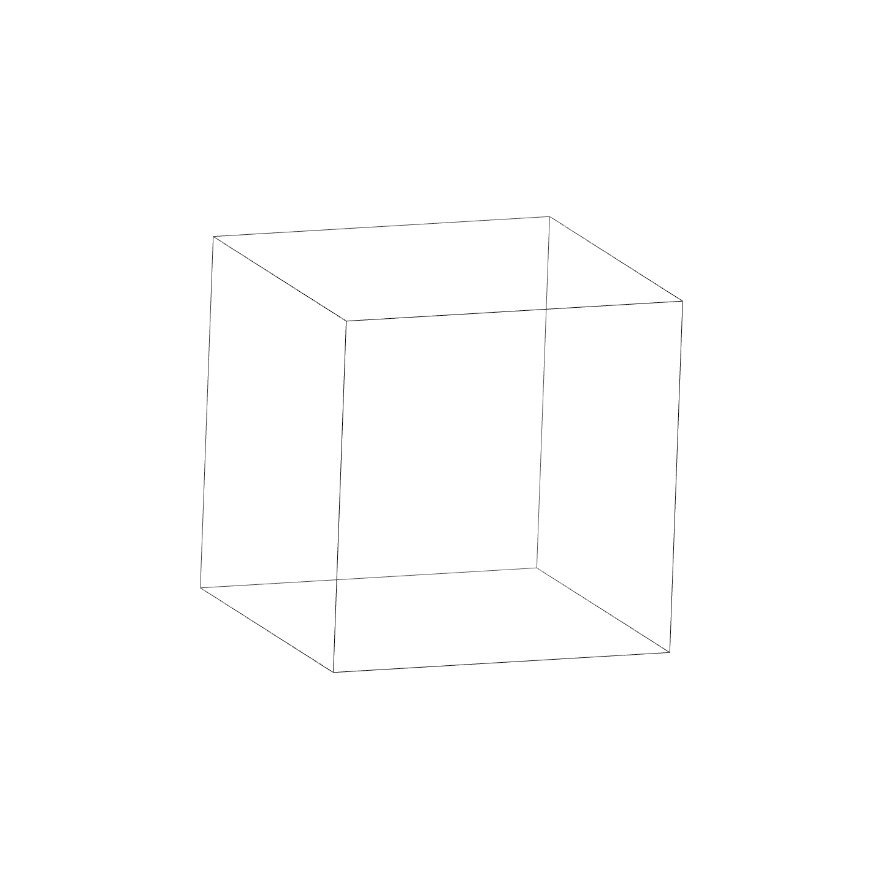

<div align="center">
	
  <h2> Crystal Generation with Space Group Informed Transformer</h2> 
</div>

_CrystalFormer_ is a transformer-based autoregressive model specifically designed for space group-controlled generation of crystalline materials. The space group symmetry significantly simplifies the
crystal space, which is crucial for data and compute efficient generative modeling of crystalline materials.

<div align="center">
  
  <h3> Generating Cs<sub>2</sub>ZnFe(CN)<sub>6</sub> Crystal (<a href=https://next-gen.materialsproject.org/materials/mp-570545>mp-570545</a>) </h3>
</div>


## Contents

- [Contents](#contents)
- [Model card](#model-card)
- [Installation](#installation)
  - [CPU installation](#cpu-installation)
  - [CUDA (GPU) installation](#cuda-gpu-installation)
  - [install required packages](#install-required-packages)
- [Available Weights](#available-weights)
- [How to run](#how-to-run)
  - [train](#train)
  - [sample](#sample)
  - [evaluate](#evaluate)
- [How to cite](#how-to-cite)

## Model card

The model is an autoregressive transformer for the space group conditioned crystal probability distribution `P(C|g) = P (W_1 | ... ) P ( A_1 | ... ) P(X_1| ...) P(W_2|...) ... P(L| ...)`, where

- `g`: space group number 1-230

- `W`: Wyckoff letter ('a', 'b',...,'A')  

- `A`: atom type ('H', 'He', ..., 'Og')

- `X`: factional coordinates

- `L`: lattice vector [a,b,c, $\alpha$, $\beta$, $\gamma$]

- `P(W_i| ...)` and `P(A_i| ...)`  are categorical distributuions. 

- `P(X_i| ...)` is the mixture of von Mises distribution. 

- `P(L| ...)`  is the mixture of Gaussian distribution. 

We only consider symmetry inequivalent atoms. The remaining atoms are restored based on the space group and Wyckoff letter information. Note that there is a natural alphabetical ordering for the Wyckoff letters, starting with 'a' for a position with the site-symmetry group of maximal order and ending with the highest letter for the general position. The sampling procedure starts from higher symmetry sites (with smaller multiplicities) and then goes on to lower symmetry ones (with larger multiplicities). Only for the cases where discrete Wyckoff letters can not fully determine the structure, one needs to further consider factional coordinates in the loss or sampling. 

## Installation
Create a new environment and install the required packages, we recommend using python `3.10.*` and conda to create the environment:
  
  ```bash
  conda create -n crystalgpt python=3.10
  conda activate crystalgpt
  ```

Before installing the required packages, you need to install `jax` and `jaxlib` first. 

### CPU installation

```bash 
pip install -U "jax[cpu]"
```

### CUDA (GPU) installation

If you intend to use CUDA (GPU) to speed up the training, it is important to install the appropriate version of `jax` and `jaxlib`. It is recommended to check the [jax docs](https://github.com/google/jax?tab=readme-ov-file#installation) for the installation guide. The basic installation command is given below:

```bash
pip install --upgrade pip

# CUDA 12 installation
# Note: wheels only available on linux.
pip install --upgrade "jax[cuda12_pip]" -f https://storage.googleapis.com/jax-releases/jax_cuda_releases.html

# CUDA 11 installation
# Note: wheels only available on linux.
pip install --upgrade "jax[cuda11_pip]" -f https://storage.googleapis.com/jax-releases/jax_cuda_releases.html
```

### install required packages

```bash
pip install -r requirements.txt
```

## Available Weights

We release the weights of the model trained on the MP-20 dataset. More details can be seen in the [model](./model/README.md) folder.


## How to run

### train

```bash 
python ./src/main.py --folder ./data/ --train_path YOUR_PATH/mp_20/train.csv --valid_path YOUR_PATH/mp_20/val.csv
```
- `folder`: the folder to save the model and logs  
- `train_path`: the path to the training dataset  
- `valid_path`: the path to the validation dataset  
- `test_path`: the path to the test dataset

### sample

```bash 
python ./src/main.py --optimizer none --test_path YOUR_PATH/mp_20/test.csv --restore_path YOUR_MODEL_PATH --spacegroup 160 --num_samples 100  --batchsize 10000 --temperature 1.0 --use_foriloop
```

- `optimizer`: the optimizer to use, `none` means no training, only sampling  
- `restore_path`: the path to the model weights  
- `spacegroup`: the space group number to sample  
- `num_samples`: the number of samples to generate  
- `batchsize`: the batch size for sampling  
- `temperature`: the temperature for sampling  
- `use_foriloop`: use `lax.fori_loop` to speed up the sampling

You can also use the `element` to sample the specific element. For example, `--element La Ni O` will sample the structure with La, Ni, and O atoms. The sampling results will be saved in the `output_LABEL.csv` file, where the `LABEL` is the space group number `g` specified in the command `--spacegroup`.

 
### evaluate

Before evaluating the generated structures, you need to transform the generated `g, W, A, X, L` to the `cif` format. You can use the following command to transform the generated structures to the `cif` format and save as the `csv` file:
```bash
python ./scripts/awl2struct.py --output_path YOUR_PATH --label SPACE_GROUP  --num_io_process 40
```
- `output_path`: the path to read the generated `L, W, A, X` and save the `cif` files
- `label`: the label to save the `cif` files, which is the space group number `g`
- `num_io_process`: the number of processes

Calculate the structure and composition validity of the generated structures:
```bash
python ./scripts/compute_metrics.py --root_path /data/zdcao/crystal_gpt/dataset/mp_20/symm_data/ --filename out_structure.csv --output_path ./ --num_io_process 40
```
- `root_path`: the path to the dataset
- `filename`: the filename of the generated structures
- `output_path`: the path to save the metrics results
- `num_io_process`: the number of processes
  
Calculate the novelty and uniqueness of the generated structures:
```bash
python ./scripts/compute_metrics_matbench.py --train_path TRAIN_PATH --test_path TEST_PATH --gen_path GEN_PATH --output_path OUTPUT_PATH --label SPACE_GROUP --num_io_process 40
```
- `train_path`: the path to the training dataset
- `test_path`: the path to the test dataset
- `gen_path`: the path to the generated dataset
- `output_path`: the path to save the metrics results
- `label`: the label to save the metrics results, which is the space group number `g`
- `num_io_process`: the number of processes

Note that the training, test, and generated datasets should contain the structures within the **same** space group `g` which is specified in the command `--label`.


More details about the post-processing can be seen in the [scripts](./scripts/README.md) folder.

## How to cite

```bibtex
@article{crystalformer2024,
  title = {Crystalformer},
  author = {Zhendong Cao and Lei Wang},
}
```
